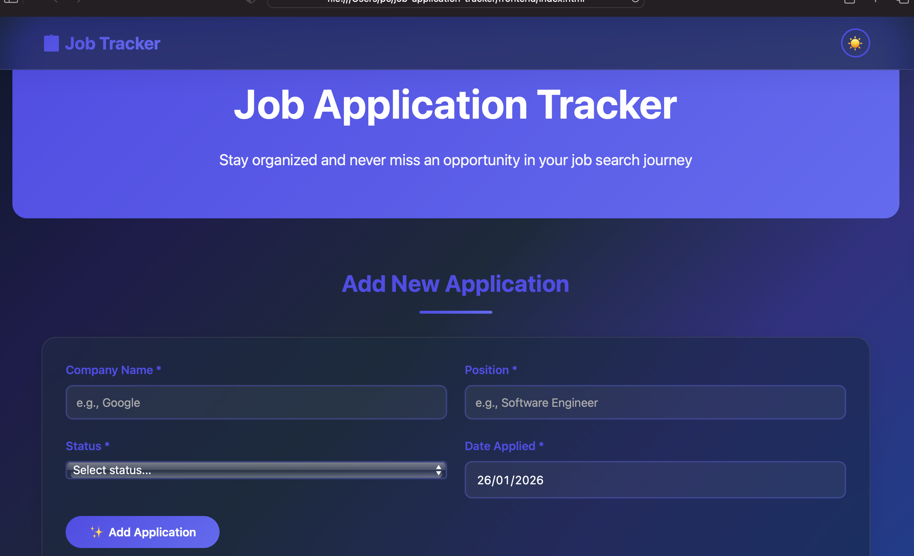
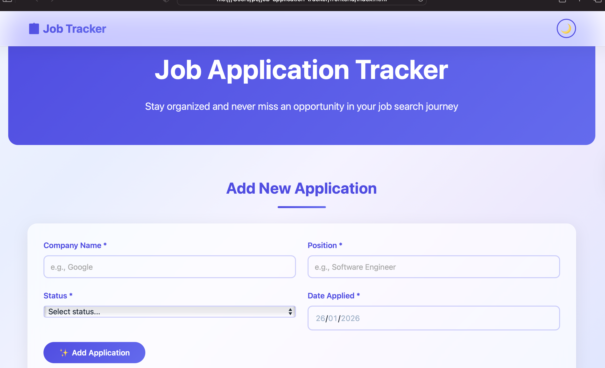
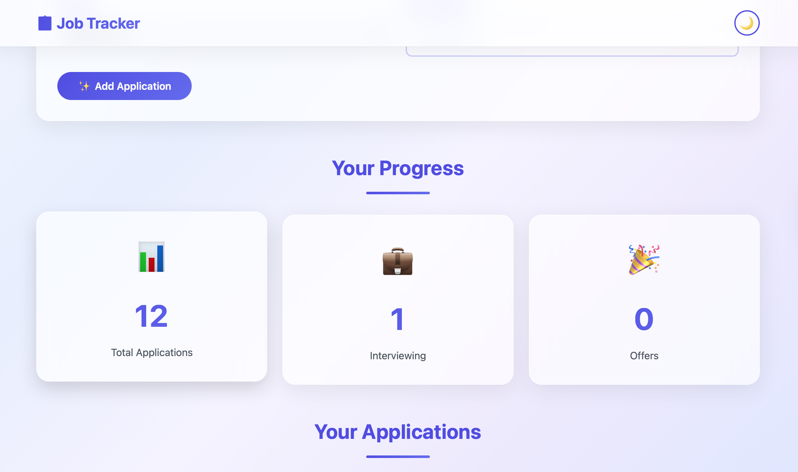
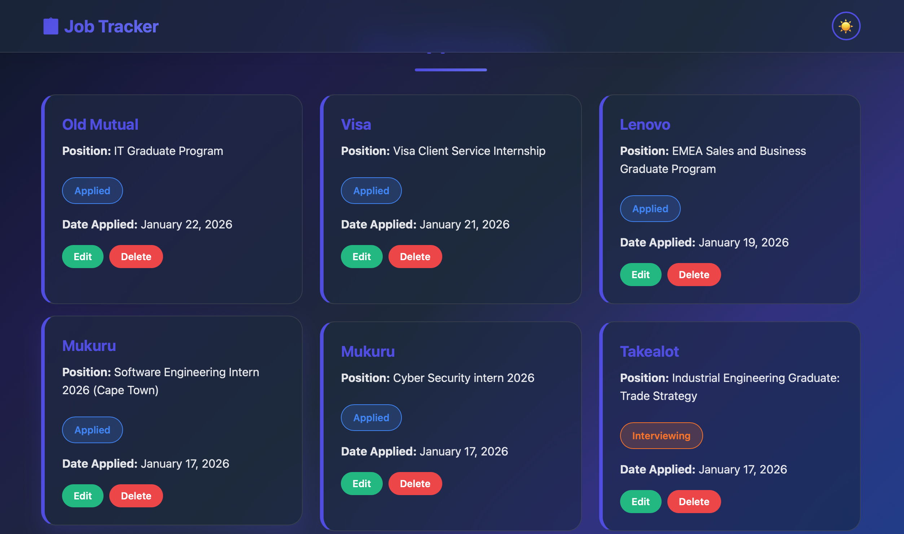

# Job Application Tracker

A serverless job application tracking system built with AWS Lambda, API Gateway, DynamoDB, and a beautiful glassmorphic UI. Stay organized and never miss an opportunity in your job search journey.

   

## 🌟 Features

- ✅ Track job applications (company, position, status, date)
- ✅ RESTful API for CRUD operations
- ✅ Serverless architecture (100% AWS Free Tier eligible)
- ✅ Beautiful glassmorphic UI with dark/light mode
- ✅ Real-time statistics dashboard
- ✅ Infrastructure as Code with Terraform
- ✅ Fully responsive design

## 🏗️ Architecture

```
Frontend (Static HTML/CSS/JS)
         ↓
API Gateway (REST API)
         ↓
Lambda Functions (Python 3.12)
         ↓
DynamoDB (NoSQL Database)
```

## 🛠️ Tech Stack

**Backend:**

- AWS Lambda (Python 3.12)
- AWS API Gateway (REST)
- AWS DynamoDB

**Frontend:**

- HTML5
- CSS3 (Glassmorphism design)
- Vanilla JavaScript

**Infrastructure:**

- Terraform
- AWS Region: af-south-1 (Cape Town, South Africa)

## 📋 Prerequisites

- AWS Account with credentials configured
- Terraform installed (v1.0+)
- Python 3.12+
- AWS CLI configured

## 🚀 Deployment

### 1. Clone the repository

```bash
git clone https://github.com/Alphiosjunior/job-application-tracker.git
cd job-application-tracker
```

### 2. Configure AWS credentials

```bash
aws configure
# Enter your AWS Access Key ID
# Enter your AWS Secret Access Key
# Region: af-south-1
```

### 3. Create Lambda deployment package

```bash
cd lambda
zip -r ../terraform/lambda_functions.zip *.py
cd ..
```

### 4. Deploy infrastructure with Terraform

```bash
cd terraform
terraform init
terraform plan
terraform apply
# Type 'yes' when prompted
```

### 5. Get the API Gateway URL

```bash
terraform output api_gateway_url
```

### 6. Update frontend with API URL

Edit `frontend/app.js` and replace `API_BASE_URL` with your actual API Gateway URL:

```javascript
const API_BASE_URL =
  "https://YOUR_API_ID.execute-api.af-south-1.amazonaws.com/dev/applications";
```

### 7. Open the frontend

```bash
cd ../frontend
open index.html
```

## 📁 Project Structure

```
job-application-tracker/
├── terraform/              # Infrastructure as Code
│   ├── main.tf            # Provider, DynamoDB table
│   ├── lambda.tf          # Lambda functions & IAM
│   ├── api_gateway.tf     # API Gateway setup
│   ├── variables.tf       # Input variables
│   └── outputs.tf         # Output values
├── lambda/                # Lambda function code
│   ├── create_application.py
│   ├── list_applications.py
│   ├── get_application.py
│   ├── update_application.py
│   ├── delete_application.py
│   └── requirements.txt
├── frontend/              # Web interface
│   ├── index.html
│   ├── styles.css
│   └── app.js
└── README.md
```

## 🔌 API Endpoints

| Method | Endpoint             | Description            |
| ------ | -------------------- | ---------------------- |
| POST   | `/applications`      | Create new application |
| GET    | `/applications`      | List all applications  |
| GET    | `/applications/{id}` | Get single application |
| PUT    | `/applications/{id}` | Update application     |
| DELETE | `/applications/{id}` | Delete application     |

## 💰 Cost

This project uses AWS Free Tier resources:

- **Lambda**: 1M free requests/month
- **API Gateway**: 1M free requests/month (first 12 months)
- **DynamoDB**: 25GB storage, 25 read/write capacity units

**Estimated cost after free tier:** < $1/month for moderate use

## 🎨 UI Features

- 🌌 Glassmorphic design with blur effects
- 🌓 Dark/Light mode toggle
- 💫 Smooth animations and transitions
- 📱 Fully responsive (mobile, tablet, desktop)
- 📊 Real-time statistics dashboard

## 🧹 Cleanup

To destroy all AWS resources and avoid charges:

```bash
cd terraform
terraform destroy
# Type 'yes' when prompted
```

## 📸 Screenshots

### Dark Mode


_Beautiful dark purple gradient with glassmorphic cards and smooth animations_

### Light Mode


_Clean light theme with subtle gradients and excellent readability_

### Dashboard Statistics


_Real-time tracking of total applications, interviews, and offers_

### Application Management


_Easy-to-use interface for tracking application status and details_

## 📄 License

MIT License - feel free to use this project for your own job search!

## 👨‍💻 Author

**Alphiosjunior Ngqele**

- GitHub: [@Alphiosjunior](https://github.com/Alphiosjunior)
- LinkedIn: [Alphiosjunior Ngqele](https://www.linkedin.com/in/alphiosjunior-iviwe-ngqele-8b510127a/)
- Email: ngqeleiviwe@gmail.com

## 🙏 Acknowledgments

- Built as part of my cloud engineering journey
- Inspired by the need to stay organized during job searching
- Special thanks to the AWS and Terraform communities

---

⭐ If you find this project helpful, please give it a star on GitHub!
